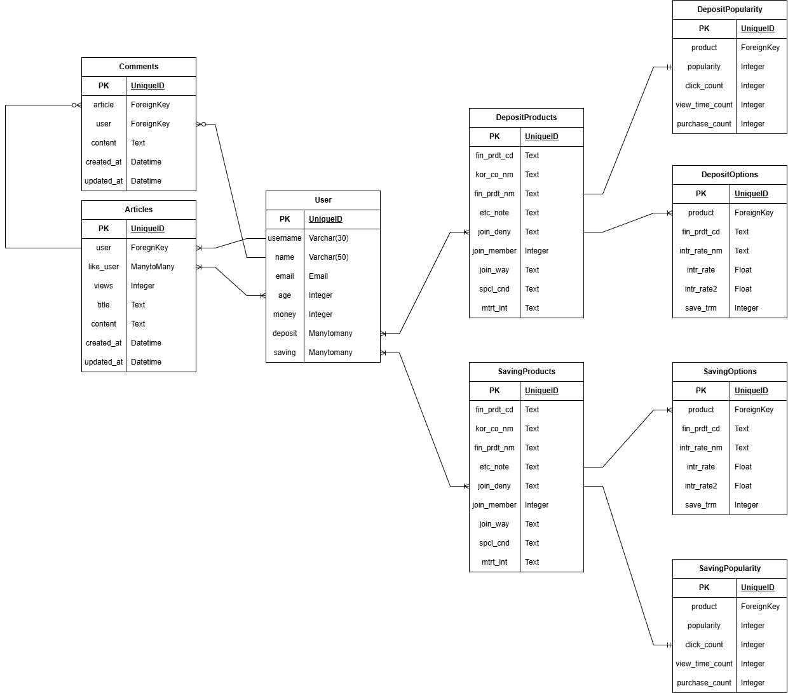

### 금융 상품 비교 애플리케이션: Seedly

#### 팀원 정보 및 업무 분담 내역
- **프로젝트 기간:** 2023/11/18 ~ 2023/11/25 (7일간)
- **팀 구성 및 역할:**

| 이름       | 역할 및 구현 기능 |
|------------|-------------------|
| **김건일** | **Back End:** ERD 설계, 회원가입, 로그인, 비밀번호 변경, 환율 정보 저장/업데이트, 금융 상품 저장, 금융 상품 필터링, 금융 상품 더미데이터 생성, 게시판 CRUD, 추천 알고리즘 개발 **Front End:** 마이페이지, 상품 금리 비교 차트 |
| **서건호** | **Front End:** 메인 페이지, 상품 추천 페이지, 상품 목록 페이지, 주변 은행 검색, 게시판 CRUD, 구매 상품 관리 페이지, 로그인, 로그아웃, 프로필 페이지 |

---

### 설계 내용 (아키텍처 등) 및 실제 구현 정도

#### 기술 스택

**🖥 Front End**
- **언어:** JavaScript
- **프레임워크:** Vue3, Pinia (+Pinia Plugin PersistedState), Bootstrap
- **라이브러리:** Axios, Chart.js

**🖥 Back End**
- **언어:** Python
- **프레임워크:** Django, Django REST Framework (DRF), dj-rest-auth

---

### 데이터베이스 모델링 (ERD)

- 아래는 Seedly 프로젝트의 ERD 예시 이미지입니다. (링크는 추후 추가 예정)

---

### 금융 상품 추천 알고리즘에 대한 기술적 설명

Seedly의 금융 상품 추천 알고리즘은 사용자 행동 데이터를 기반으로 **인기도 점수**를 계산하여 상위 10개의 금융 상품을 추천합니다. 이를 위해 다음과 같은 요소에 가중치를 부여하여 인기도를 산출합니다:

1. **상품 조회 횟수**: 사용자가 특정 상품을 조회한 빈도를 기반으로 점수를 부여.
2. **페이지 머무른 시간**: 사용자가 상품 페이지에 머문 시간을 측정하여 관심도를 반영.
3. **구매 횟수**: 해당 상품의 실제 구매 빈도를 통해 최종 점수에 가장 높은 가중치를 부여.

---

### 서비스 대표 기능들에 대한 설명

#### 1️⃣ 메인 페이지
- Seedly의 주요 서비스를 한눈에 볼 수 있는 페이지로, 사용자 친화적인 UI/UX를 제공합니다.
- 금융 상품 비교, 추천 상품, 환율 계산기 등 핵심 기능을 간략히 소개합니다.

---

#### 2️⃣ 로그인, 회원가입, 비밀번호 초기화
- **로그인 및 회원가입**:
  - 이메일 및 비밀번호 기반 인증.
  - 회원가입 시 유효성 검사(이메일 형식, 비밀번호 조건 등)를 적용.
- **비밀번호 초기화**:
  - 이메일 인증을 통해 비밀번호를 재설정할 수 있는 기능을 제공합니다.

---

#### 3️⃣ 프로필 페이지 및 구매 상품 관리 페이지
- **프로필 페이지**:
  - 사용자의 개인 정보를 확인하고 수정할 수 있습니다.
  - 프로필 이미지 업로드 및 기본 정보(이름, 이메일 등) 변경 가능.
- **구매 상품 관리 페이지**:
  - 사용자가 구매한 금융 상품의 목록을 확인하고, 상세 정보를 조회하거나 해지 요청을 할 수 있습니다.

---

#### 4️⃣ 추천 상품 페이지
- Seedly의 추천 알고리즘에 기반하여 사용자 맞춤형 금융 상품을 추천합니다.
- 추천된 상품은 인기도 점수 순으로 정렬되며, 클릭 시 상세 정보를 확인할 수 있습니다.

---

#### 5️⃣ 금융 상품 비교 페이지
- **정기 예금 및 적금 비교**:
  - 모든 금융 상품의 금리를 테이블 형태로 제공하며, 이자율 기준으로 정렬 가능.
  - 은행별 필터링 및 상세 정보 확인 기능 제공.
- **차트 시각화**:
  - 금융 상품의 금리를 기간별로 시각화하여 한눈에 비교 가능.

---

#### 6️⃣ 환율 계산 페이지
- 다양한 통화 간 환율 계산 기능 제공.
- 송금 보내기/받기와 매매 기준율에 따른 환율 계산이 가능합니다.
- 네이버 환율 그래프와 연동하여 최근 환율 추이를 확인할 수 있습니다.

---

#### 7️⃣ 주변 은행 찾기 페이지
- 사용자의 현재 위치 또는 선택한 지역을 기준으로 은행 지점을 검색할 수 있습니다.
- 특정 은행을 선택하면 해당 은행의 금융 상품 목록도 함께 표시됩니다.

---

#### 8️⃣ 커뮤니티 페이지
- 인증된 사용자들 간 금융 관련 정보를 공유할 수 있는 자유 게시판입니다.
- **게시물 CRUD**:
  - 게시물 작성, 수정, 삭제 및 댓글 기능 제공.
- **페이지네이션**:
  - 게시물을 일정 단위로 나눠 사용자 편의성을 높였습니다.

### 느낀 점, 후기 및 보완점

---

#### 느낀 점
- **김건일**: 이번 프로젝트를 통해 백엔드와 프론트엔드의 협업 과정을 깊이 이해할 수 있었습니다. 특히, 금융 상품 데이터를 처리하고 추천 알고리즘을 구현하는 과정에서 데이터 구조 설계의 중요성을 다시금 느꼈습니다. 짧은 시간 안에 많은 기능을 구현했지만, 더 효율적인 코드 작성과 테스트의 필요성을 깨달았습니다.
- **서건호**: 프론트엔드 개발자로서 사용자 경험(UX)을 고려한 UI 설계와 구현에 집중했습니다. 다양한 페이지를 구성하며 Vue.js의 강력함과 한계를 동시에 경험할 수 있었고, 팀원들과의 협업을 통해 더 나은 방향으로 문제를 해결할 수 있었습니다.

---

#### 후기
- **김건일**: 프로젝트 기간 동안 많은 것을 배웠지만, 특히 추천 알고리즘 개발과 데이터 모델링에서 얻은 경험은 앞으로의 개발에 큰 자산이 될 것 같습니다. 팀원들과 함께 목표를 이루어가는 과정이 즐거웠습니다.
- **서건호**: 처음부터 끝까지 사용자 중심의 서비스를 만들기 위해 노력했습니다. 프로젝트를 진행하며 Vue.js와 Bootstrap을 활용해 다양한 컴포넌트를 제작하는 데 자신감을 얻었고, 앞으로 더 나은 UI/UX를 제공할 수 있는 개발자가 되고 싶습니다.

---

#### 보완점
1. **추천 알고리즘 개선**:
   - 현재는 단순한 인기도 기반 추천 알고리즘을 사용하고 있지만, 향후에는 협업 필터링(Collaborative Filtering)이나 콘텐츠 기반 추천(Content-Based Recommendation)으로 확장 가능성을 열어두고 있습니다.
2. **테스트 환경 강화**:
   - 유닛 테스트 및 통합 테스트를 통해 코드 품질을 높이고, 예상치 못한 오류를 줄이는 작업이 필요합니다.
3. **디자인 일관성 유지**:
   - Bootstrap을 사용하여 빠르게 UI를 구성했지만, 디자인 가이드라인을 정립하여 더욱 일관된 사용자 경험을 제공할 필요가 있습니다.
4. **반응형 웹 최적화**:
   - 모바일 환경에서도 최적화된 UI/UX를 제공하기 위해 반응형 디자인을 더욱 강화해야 합니다.
5. **API 성능 최적화**:
   - 대규모 데이터 처리 시 API 응답 속도를 개선하기 위해 쿼리 최적화 및 캐싱 전략을 도입할 계획입니다.

<!-- 
#### 알고리즘 작동 방식
1. **데이터 수집**:
   - 사용자 행동 데이터(조회 횟수, 머무른 시간, 구매 기록)를 실시간으로 수집.
   - 데이터는 로그 파일 또는 데이터베이스에 저장.

2. **가중치 계산**:
   - 각 행동 요소(조회, 머무른 시간, 구매)에 대해 가중치를 설정.
   - 예를 들어:
     - 조회 횟수: 0.3
     - 머무른 시간: 0.2
     - 구매 횟수: 0.5
   - 각 요소의 점수를 합산하여 최종 인기도 점수를 계산.

3. **상위 상품 선정**:
   - 계산된 인기도 점수를 기준으로 금융 상품을 정렬.
   - 상위 10개의 상품을 사용자에게 추천.

4. **실시간 업데이트**:
   - 사용자의 최신 행동 데이터를 반영하여 추천 리스트를 실시간으로 갱신.

---

#### 추가 고려 사항
- **콜드 스타트 문제 해결**:
  - 신규 사용자나 데이터가 부족한 경우, 전체 사용자 데이터를 기반으로 인기 있는 금융 상품을 추천.
- **개인화 추천**:
  - 사용자의 과거 행동 데이터를 분석하여 개인화된 추천 리스트를 제공.
- **추천 정확도 평가**:
  - NDCG, Precision, Recall 등의 지표를 활용해 추천 시스템의 성능을 주기적으로 평가.

Seedly의 알고리즘은 단순한 인기도 기반 추천에서 출발하지만, 향후에는 협업 필터링(Collaborative Filtering)이나 딥러닝 기반 모델로 확장 가능성을 열어두고 있습니다. -->